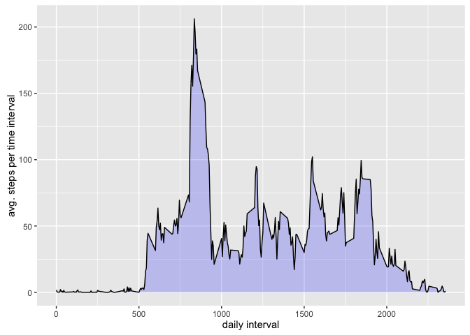

# Reproducible Research: Peer Assessment 1
##John Condon

## Loading and preprocessing the data

```r
activity <- read.csv("activity.csv")
```
Examine the data.

```r
str(activity)
```

```
## 'data.frame':	17568 obs. of  3 variables:
##  $ steps   : int  NA NA NA NA NA NA NA NA NA NA ...
##  $ date    : Factor w/ 61 levels "2012-10-01","2012-10-02",..: 1 1 1 1 1 1 1 1 1 1 ...
##  $ interval: int  0 5 10 15 20 25 30 35 40 45 ...
```

```r
summary(activity)
```

```
##      steps                date          interval     
##  Min.   :  0.00   2012-10-01:  288   Min.   :   0.0  
##  1st Qu.:  0.00   2012-10-02:  288   1st Qu.: 588.8  
##  Median :  0.00   2012-10-03:  288   Median :1177.5  
##  Mean   : 37.38   2012-10-04:  288   Mean   :1177.5  
##  3rd Qu.: 12.00   2012-10-05:  288   3rd Qu.:1766.2  
##  Max.   :806.00   2012-10-06:  288   Max.   :2355.0  
##  NA's   :2304     (Other)   :15840
```
There are 17568 observation of 3 variables: steps, date, and interval.
2304 of the step observations are missing (NA values).
Date is a factor with 61 levels in yyyy-mm-dd format.
The data encompass the period Oct 1, 2010 to Nov 30, 2010.  Each day has 288 
observations taken at 5 minutes intervals.

The major issue with the data is the 2304 missing step observations. About 
13% of the step data is missing.

## What is mean total number of steps taken per day?

(Note: For this part of the assignment, missing values in the dataset 
were ignored)

Calculate the total number of steps taken per day

```r
library(dplyr)
```

```
## 
## Attaching package: 'dplyr'
## 
## The following objects are masked from 'package:stats':
## 
##     filter, lag
## 
## The following objects are masked from 'package:base':
## 
##     intersect, setdiff, setequal, union
```

```r
day.steps <- activity %>% group_by(date) %>% summarize(total.steps=sum(steps))
```

Make a histogram of the total number of steps taken each day

```r
library(ggplot2)
```

```r
# Make a histogram of the total number of steps taken each day
g <- ggplot(day.steps, aes(x=total.steps)) +
        geom_histogram(fill="white",color="black") +
        ylab("day count") + xlab("total steps each day")

g
```

```
## `stat_bin()` using `bins = 30`. Pick better value with `binwidth`.
```

```
## Warning: Removed 8 rows containing non-finite values (stat_bin).
```

 

The mean and median steps taken per day were:

```r
summary(day.steps$total.steps)[3:4]
```

```
## Median   Mean 
##  10760  10770
```

## What is the average daily activity pattern?

Create a dataset of the average number of steps taken for each 5-minute interval, averaged across 
all days.


```r
intervals <- activity %>% group_by(interval) %>% summarize(avg.steps=round(mean(steps,na.rm=TRUE),1))
```
Make a time series plot of the 5-minute interval (x-axis) and the average steps taken (y-axis).


```r
g.ti <- ggplot(intervals, aes(x=interval, y=avg.steps)) +
        geom_area(fill="blue",alpha=.2) +
        geom_line() +
        xlab("daily interval") + ylab("avg. steps per time interval")
g.ti
```

 


Which 5-minute interval, on average across all the days in the dataset, contains the maximum number of steps?


```r
filter(intervals, avg.steps == max(avg.steps))
```

```
## Source: local data frame [1 x 2]
## 
##   interval avg.steps
##      (int)     (dbl)
## 1      835     206.2
```

## Imputing missing values

There are a number of days/intervals where there are missing values (coded as NA).
The presence of this missing interval data may introduce bias into some 
calculations or summaries of the data.

Calculate and report the total number of missing values in the dataset (i.e. the total number of rows with 𝙽𝙰.s)


```r
NA.rows <- activity[!complete.cases(activity),]
```
There are 2304 interval rows with missing values.

The strategy for filling the missing values in the dataset will be to use
the overall interval mean for the intervals with missing data.

Create a new dataset that is equal to the original dataset but with the missing data filled in.

```r
activity.imp <- activity
# impute missing values by using the mean value for the empty interval
for(i in 1:nrow(activity.imp)) {
        if(is.na(activity.imp[i,1])) {
                x = filter(intervals,interval == activity.imp[i,3])
                activity.imp[i,1] = x$avg.steps
        }
}
```
Make a histogram of the total number of steps taken each day. 

Calculate the total number of steps taken per day.


```r
day.steps2 <- activity.imp %>% group_by(date) %>% summarize(total.steps2=sum(steps))
```

Make a histogram of the total number of steps taken each day.


```r
g <- ggplot(day.steps2, aes(x=total.steps2)) +
        geom_histogram(fill="white",color="black") +
        xlab("total daily steps") + ylab("count")

g
```

```
## `stat_bin()` using `bins = 30`. Pick better value with `binwidth`.
```

 

The mean and median of the total number of steps taken per day were:

```r
summary(day.steps2$total.steps2)[3:4]
```

```
## Median   Mean 
##  10770  10770
```


Do these values differ from the estimates from the first part of the assignment?

The mean and median of the total steps per day from the original data set were:

```r
summary(day.steps$total.steps)[3:4]
```

```
## Median   Mean 
##  10760  10770
```
This is a negligible difference with the mean and median from the imputed data set and the
original dataset with missing values. Since intervals averaged over all the days were used to impute missing values, the daily averages were not significantly different. 


## Are there differences in activity patterns between weekdays and weekends?


Create a new factor variable day.type with two levels – “weekday” and “weekend” indicating
whether a given date is a weekday or weekend day.


Change the format of the date variable from a factor to character and then to date so that the weekdays
function can be used to identify weekday or weekend days.


```r
activity.imp$date <- as.character(activity.imp$date)
activity.imp$date <- as.Date(activity.imp$date)
```

Create vectors of weekdays and weekend days

```r
weekday <- c("Mon","Tue","Wed","Thu","Fri")
weekend <- c("Sat","Sun")
```
Create the day.type factor and set it to "weekday" or "weekend"


```r
activity.imp$day.type <- "NA"
for (i in 1:nrow(activity.imp)) {
        if (weekdays(activity.imp[i,2],abbreviate=TRUE) %in% weekday) {
                activity.imp[i,4] <- "weekday"
        } else {
                activity.imp[i,4] <- "weekend"
        }
}

activity.imp$day.type <- as.factor(activity.imp$day.type)
```


Create a dataset that contains average number of steps taken, averaged across 
all weekday days or weekend days.


```r
day.type.intervals <- activity.imp %>% group_by(interval, day.type) %>%
        summarize(avg.steps=round(mean(steps),1))
```

Make a panel plot containing a time series plot of the 5-minute interval (x-axis)
for weekday days and weekend days (y-axis).


```r
p <- ggplot(day.type.intervals, aes(x=interval, y=avg.steps)) +
        geom_area(fill="blue", alpha=.2) +
        geom_line() +
        xlab("Interval") + ylab("Avg. Numbber of Steps") +
        facet_grid(day.type ~ .) +
        theme(strip.text = element_text(face="bold",
                                        size=rel(1.25)),
              strip.background = element_rect(fill="lightblue",
                                              colour="black",
                                              size=1))
p
```

 


